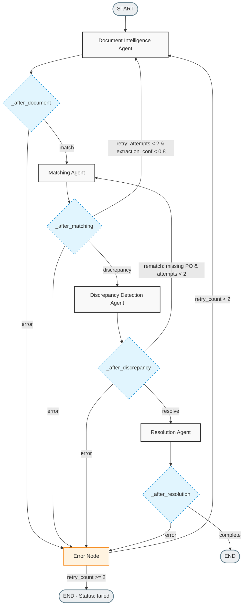
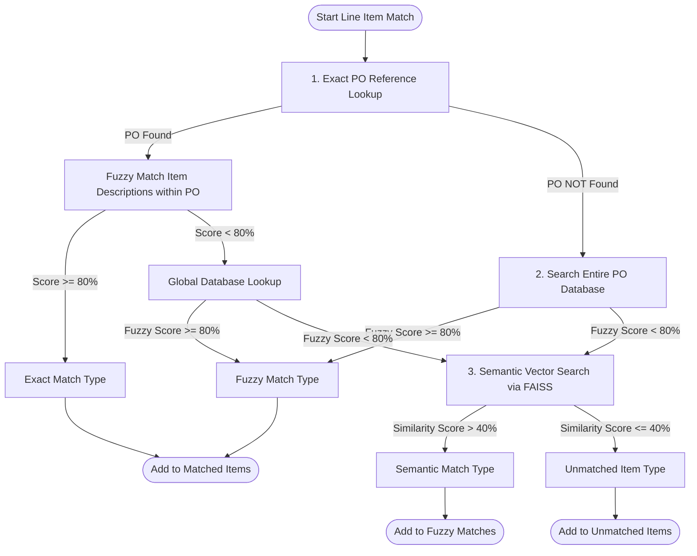

# 🧾 Multi-Agent Invoice Reconciliation System

A production-grade, multi-agent AI system built to automate end-to-end invoice reconciliation. It processes supplier invoices (digital PDFs, scanned images, rotated documents), extracts structured financial data, matches line items to a Purchase Order (PO) database, flags price and quantity discrepancies, and generates explainable approval recommendations.

Powered by **LangGraph**, **LangChain**, **Groq LLM (Llama 3.3 70B)**, **FAISS Vector Indexing**, **SentenceTransformers**, **RapidFuzz**, **OpenCV**, **FastAPI**, and **React**.

---

## 🗺️ System Architecture

The core of the system is orchestrated using **LangGraph**, where specialized agents manage distinct steps, share a unified typed state, and perform conditional loops based on extraction quality and matching confidence.

### LangGraph Agentic Workflow

This state machine controls the pipeline. It handles loops such as *re-extracting* if matching confidence is low due to poor extraction, and *re-matching* if a discrepancy indicates a missing PO reference.



### Shared State Management (`InvoiceState`)
All agents communicate by reading and updating a centralized state object defined in [state.py](file:///c:/Users/Naidu/OneDrive/Desktop/Assignment_Submission/invoice-reconciliation-system/core/state.py). 

```python
class InvoiceState(TypedDict, total=False):
    # Input
    invoice_path: str
    invoice_filename: str
    uploaded_po_path: Optional[str]
    po_database: List[Dict[str, Any]]

    # Processing metadata
    processing_id: str
    processing_started: str
    processing_completed: Optional[str]
    current_agent: str

    # Agent outputs
    extraction_result: Optional[ExtractionResult]
    match_result: Optional[MatchResult]
    matched_po: Optional[Dict[str, Any]]
    discrepancies: List[Discrepancy]
    recommendation: Optional[Recommendation]

    # Reasoning chain
    agent_steps: List[AgentStep]  # Holds the full explainability timeline

    # Error handling & Control Flow
    errors: List[Dict[str, Any]]
    requires_retry: bool
    retry_count: int

    # Configuration & Output status
    app_config: Dict[str, Any]
    status: str  # processing, completed, failed, requires_review
    overall_confidence: float
```

Each step appended to the `agent_steps` array logs:
* `agent_name`: The active agent.
* `timestamp`: Time of execution.
* `input_summary` & `output_summary`: Concise data summaries.
* `reasoning`: The explanation behind the agent's decisions.
* `confidence`: The agent's confidence score ($0.0$ to $1.0$).
* `execution_time`: Latency in seconds.

---

## 🤖 Deep Dive: The 5 Specialized Agents

The system distributes tasks across five autonomous agents.

### 1. Document Intelligence Agent
* **File Location**: [document_intelligence.py](file:///c:/Users/Naidu/OneDrive/Desktop/Assignment_Submission/invoice-reconciliation-system/agents/document_intelligence.py)
* **Objective**: Ingests raw documents (PDF, PNG, JPG, TIFF) and extracts a structured invoice representation containing the invoice number, supplier name, date, PO reference, subtotal, tax, currency, and line items.
* **Cascading Fallback Processing**:
  1. **Native Text Parsing**: Attempts to parse the PDF directly using `pdfplumber`.
  2. **Image Conversion**: If the native text is empty or lacks structure, it uses `PyMuPDF` to render the pages to BGR images at 300 DPI (eliminating the system dependency on Poppler).
  3. **Computer Vision Preprocessing**: Converts page images to grayscale, applies Otsu binarization (`cv2.threshold` with `THRESH_BINARY + THRESH_OTSU`), and performs a `medianBlur` (kernel size 3) to denoise the output.
  4. **Tesseract OCR**: Extracts text from the preprocessed images using `pytesseract` with configuration parameters `--psm 6 --oem 3`.
  5. **Generative Extraction**: Feeds the raw text to a LangChain LCEL chain backed by `ChatGroq` (`llama-3.3-70b-versatile`) with structured schemas parsed by `StructuredOutputParser`.
  6. **Regex Heuristic Parser**: Acts as a backup rule-based field extractor if the LLM API fails.

### 2. Purchase Order (PO) Extraction Agent
* **File Location**: [po_extraction_agent.py](file:///c:/Users/Naidu/OneDrive/Desktop/Assignment_Submission/invoice-reconciliation-system/agents/po_extraction_agent.py)
* **Objective**: Triggered when a new purchase order is uploaded via the `/api/upload/po` REST endpoint. It reads the PO document, extracts its details (PO number, vendor, order date, line items), calculates an extraction confidence score, and writes the structured data back to the primary PO database.

### 3. Matching Agent
* **File Location**: [matching_agent.py](file:///c:/Users/Naidu/OneDrive/Desktop/Assignment_Submission/invoice-reconciliation-system/agents/matching_agent.py)
* **Objective**: Matches extracted invoice line items against the PO database using a 3-tier matching pipeline.
* **Algorithmic Match Pipeline**:

* **Matching Rules**:
  * **Fuzzy String Matching**: Uses `RapidFuzz` to compute a Levenshtein-based token sort ratio on normalized text strings. If the match ratio is $\ge 0.80$, the item is classified as `"exact"` or `"fuzzy"`.
  * **Semantic Vector Search**: When fuzzy matching fails, the item description is vectorized using `SentenceTransformers` (`all-MiniLM-L6-v2`) and matched using a **FAISS Flat L2 index**.
  * **Similarity Conversion**: The L2 distance $d$ returned by FAISS is mapped to a 0-to-1 similarity score using:
    $$\text{similarity} = \max\left(0, 1.0 - \frac{d}{2.0}\right)$$
    Matches with similarity $>0.40$ are stored as `"semantic"`.
  * **Weighted Confidence Scoring**: The overall matching confidence is computed as:
    $$\text{Confidence} = \frac{\text{high-conf matches} + \sum (\text{semantic matches} \times \text{weight})}{\text{total invoice line items}}$$
    *Semantic matches with a score $>0.70$ receive a weight of $0.8$, while matches with a score $\le 0.70$ receive a weight of $0.5$.*

### 4. Discrepancy Detection Agent
* **File Location**: [discrepancy_detection.py](file:///c:/Users/Naidu/OneDrive/Desktop/Assignment_Submission/invoice-reconciliation-system/agents/discrepancy_detection.py)
* **Objective**: Compares matched invoice elements against PO values to identify structural and financial mismatches.
* **Core Validations**:
  * **Price Mismatch**: Flags unit price differences. A difference $\ge 5\%$ is a `warning`; a difference $\ge 10\%$ is a `critical` discrepancy.
  * **Quantity Mismatch**: Flags any quantity variation (with a configurable tolerance, defaults to 0).
  * **Total Amount Mismatch**: Checks if the sum of individual line item totals differs from the reported invoice grand total by more than 15%.
  * **Missing PO Reference**: Flags missing PO numbers. Classified as a `warning` if a high-confidence semantic match is found, and `critical` if no match is found.
  * **Unmatched Items**: Flags invoice items that could not be matched to any PO item.

### 5. Resolution Recommendation Agent
* **File Location**: [resolution_agent.py](file:///c:/Users/Naidu/OneDrive/Desktop/Assignment_Submission/invoice-reconciliation-system/agents/resolution_agent.py)
* **Objective**: Analyzes the accumulated discrepancies, extraction quality, and matching confidence to make a final recommendation.
* **Decision Matrix**:
  * **`escalate_to_human`**: Triggered if there are any `critical` discrepancies (e.g., price differences $\ge 10\%$ or an unidentified PO reference).
  * **`unapproved`**: Triggered if document extraction confidence falls below $0.50$, indicating a blurry or corrupted upload.
  * **`auto_approve`**: Triggered if there are no discrepancies, all items are exact matches, and the overall confidence score is $\ge 0.95$ (auto-approve threshold).
  * **`pending`**: Triggered if minor warnings are present (e.g., small price differences between $5\%$ and $10\%$, or quantity variations), requiring manual confirmation.
* **Special Downgrading Logic**: If the only critical discrepancy is `missing_po_reference` but the matching agent finds a semantic match with confidence $\ge 0.80$, the issue is downgraded to a `warning`, and the invoice is routed to `pending` instead of `escalate_to_human`.

---

## 📡 Backend API Reference

The backend is built with **FastAPI** ([main.py](file:///c:/Users/Naidu/OneDrive/Desktop/Assignment_Submission/backend/app/main.py)) and manages job states asynchronously.

### Endpoint Overview

| Method | Route | Parameter / Body | Description |
|:---|:---|:---|:---|
| **GET** | `/api/health` | None | Returns backend status, LLM models, active queue load, and PO database size. |
| **POST** | `/api/upload/invoice` | `file: UploadFile` | Uploads an invoice PDF or image. Returns a `file_id`. |
| **POST** | `/api/upload/po` | `file: UploadFile` | Uploads a new purchase order PDF, runs extraction, and inserts it into the database. |
| **POST** | `/api/process` | `ProcessRequest` (JSON) | Enqueues a job for invoice processing. |
| **GET** | `/api/status/{job_id}` | `job_id: str` | Returns the current agent execution step, status, and progress. |
| **GET** | `/api/result/{job_id}` | `job_id: str` | Retrieves the full structured reconciliation result and agent reasoning chain. |
| **GET** | `/api/report/{job_id}/pdf`| `job_id: str` | Generates and downloads a PDF reconciliation report. |
| **PATCH** | `/api/job/{job_id}/action`| `UpdateJobActionRequest` | Allows a user to manually overwrite the AI recommendation action. |
| **GET** | `/api/stats` | None | Returns overall system stats (totals, approvals, review queue sizes). |

---

## 🎨 React Frontend Dashboard

The frontend is a React application built with TypeScript and Tailwind CSS ([Index.tsx](file:///c:/Users/Naidu/OneDrive/Desktop/Assignment_Submission/invoice-harmony/src/pages/Index.tsx)).

* **File Drag-and-Drop**: Upload interface supporting invoices and purchase orders.
* **Status Stepper**: A visual timeline showing the progress of active agents in the backend.
* **Timeline Auditor**: Displays the reasoning, confidence, and processing time for each agent.
* **Discrepancy Analyzer**: A side-by-side table comparing expected PO values with actual invoice values.
* **Manual Override Actions**: Allows users to manually overwrite recommendations (Approve, Unapprove, Escalate) directly from the UI.
* **PDF Report Downloader**: Downloads the PDF reconciliation report via `/api/report/{job_id}/pdf`.

---

## ⚙️ System Configuration

Configure agent behavior, thresholds, and LLM settings in [config.yaml](file:///c:/Users/Naidu/OneDrive/Desktop/Assignment_Submission/invoice-reconciliation-system/config.yaml).

```yaml
agents:
  document_intelligence:
    confidence_threshold: 0.7
    ocr_config: "--psm 6 --oem 3"
    preprocessing:
      deskew: true
      denoise: true
  matching:
    fuzzy_threshold: 0.80          # Levenshtein ratio threshold (RapidFuzz)
    semantic_similarity: true      # Enable SentenceTransformers + FAISS
    embedding_model: "all-MiniLM-L6-v2"
  discrepancy_detection:
    price_tolerance_percent: 5.0   # Mismatches above 5% trigger warnings
    quantity_tolerance: 0
  resolution:
    auto_approve_confidence: 0.95  # Required confidence for auto-approvals

llm:
  provider: "groq"
  model: "llama-3.3-70b-versatile" # Fast inference
  temperature: 0.1                 # Low temperature for deterministic outputs
  max_tokens: 4096
```

---

## 🚀 Quick Start Guide

### Prerequisites
* **Python 3.11+**
* **Node.js 18+**
* **Tesseract OCR Engine**:
  * **Windows**: Download the installer from the [Tesseract OCR Wiki](https://github.com/UB-Mannheim/tesseract/wiki) and add it to your system PATH.
  * **macOS**: Install via Homebrew: `brew install tesseract`
  * **Linux**: Install via apt: `sudo apt-get install tesseract-ocr`

### Setup Steps

#### 1. Configure the Environment
Create a `.env` file in the `backend` directory and add your Groq API key:
```env
GROQ_API_KEY=gsk_your_actual_groq_api_key_here
```

#### 2. Run the LangGraph Pipeline (CLI)
You can process invoices directly from the command line:
```bash
cd invoice-reconciliation-system
python -m venv venv
# Windows
venv\Scripts\activate
# macOS/Linux
source venv/bin/activate

pip install -r requirements.txt
python main.py --invoice ../Invoice_1_Baseline.pdf
```

#### 3. Run the FastAPI Backend
Start the REST API server:
```bash
cd backend
python -m venv venv
# Windows
venv\Scripts\activate
# macOS/Linux
source venv/bin/activate

pip install -r requirements.txt
python -m uvicorn app.main:app --reload --port 8000
```
*API docs will be available at `http://localhost:8000/docs`.*

#### 4. Run the React Frontend
Start the Vite development server:
```bash
cd invoice-harmony
npm install
npm run dev
```
*The dashboard will run at `http://localhost:5173`.*

#### 5. Docker Deployment
To run the backend, redis/job workers, and frontend in Docker:
```bash
cd backend
docker-compose up --build
```

---

## 📊 Performance Benchmarks

The system was validated using five test invoices:

| Test File | Format Details | OCR Required | Match Path | Action Result | Reason |
|:---|:---|:---|:---|:---|:---|
| **Invoice 1 — Baseline** | Digital PDF | No | Exact | `auto_approve` | Complete match, high extraction confidence. |
| **Invoice 2 — Scanned** | Scanned Image | Yes | Exact | `escalate_to_human` | Handled via PyMuPDF + OpenCV + Tesseract OCR. |
| **Invoice 3 — Alt Format** | Different Layout | No | Exact | `auto_approve` | Layout-agnostic extraction via LLM mapping. |
| **Invoice 4 — Price Trap** | Price Mismatch | No | Exact | `escalate_to_human` | Unit price was increased by 10% (exceeding tolerance). |
| **Invoice 5 — Missing PO** | No PO Reference | No | Semantic | `escalate_to_human` | Line items matched to a PO using FAISS semantic search. |

---

*Built with LangGraph • LangChain • FastAPI • React*
